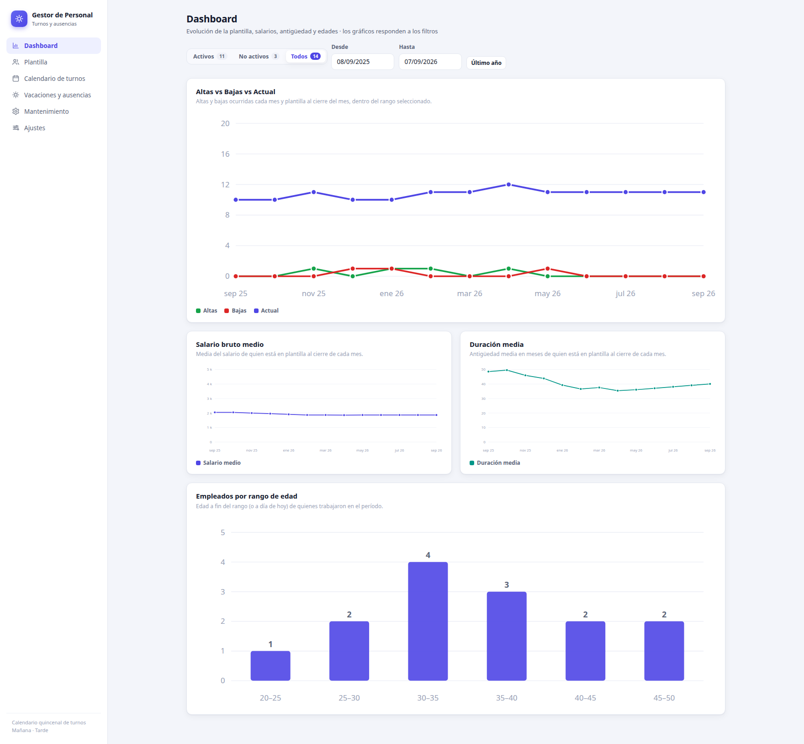
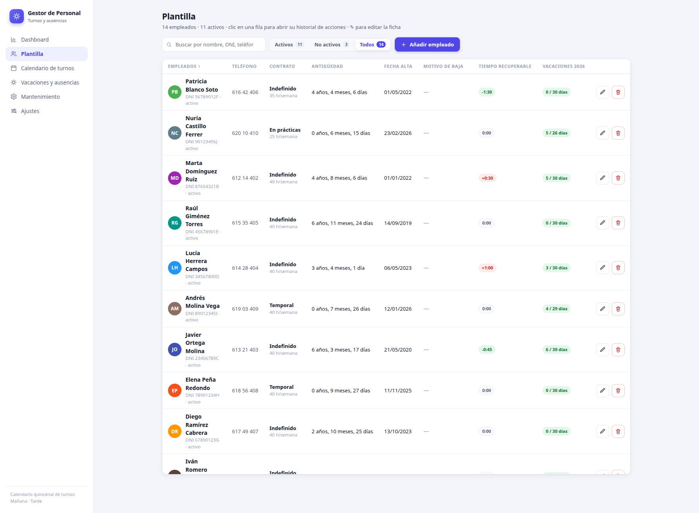
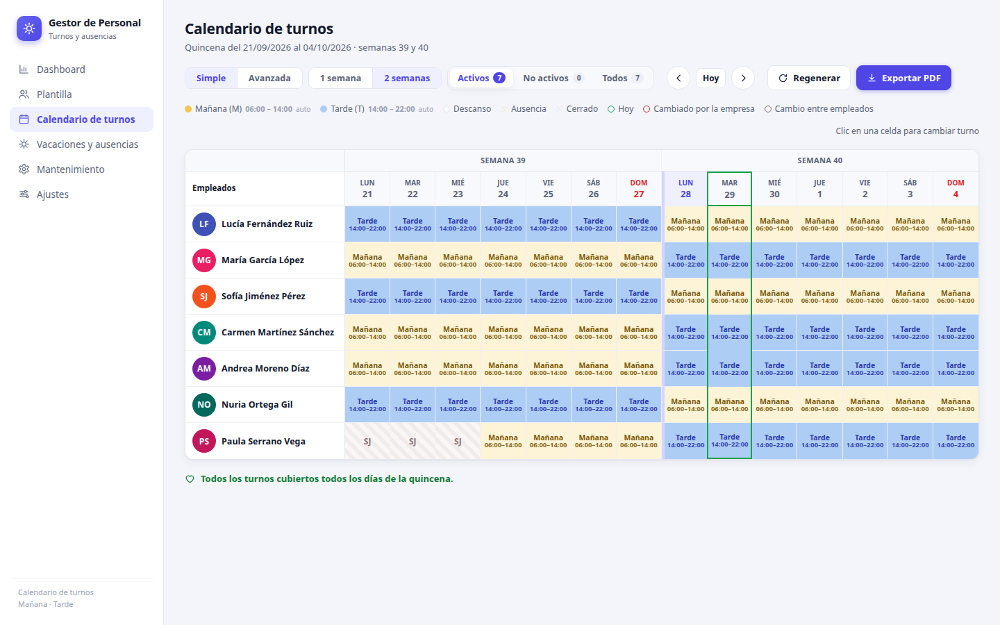
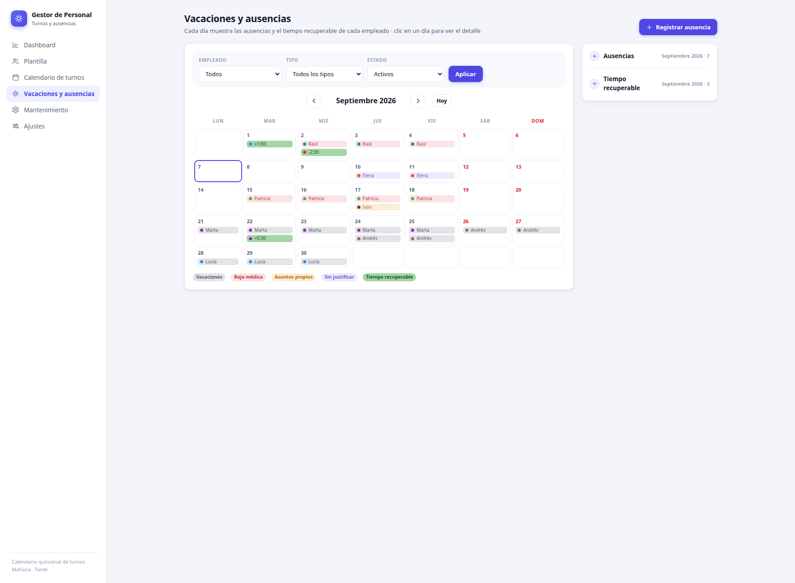
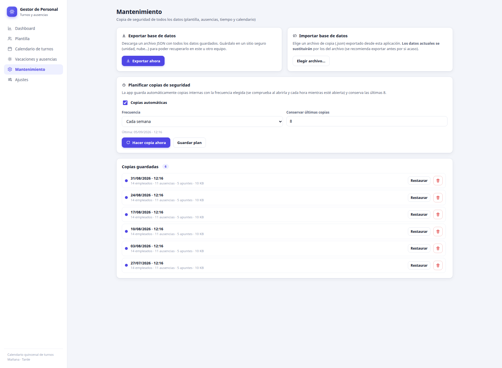
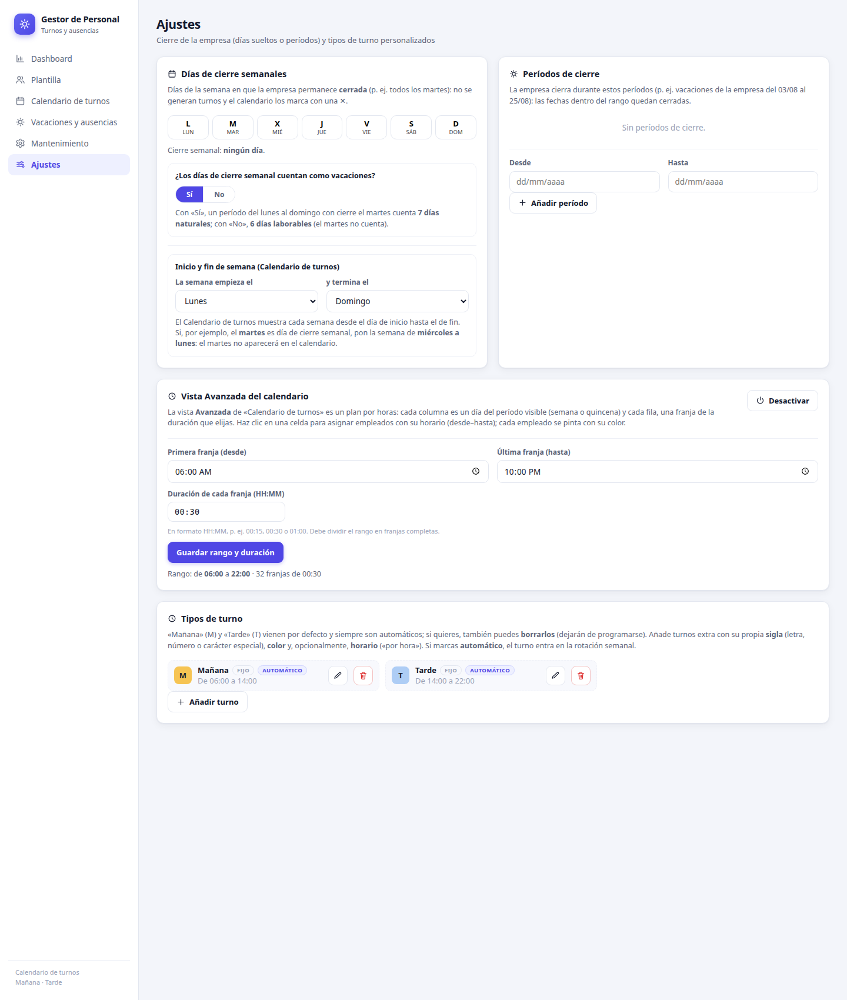

# Personal-Management — Shift Calendar

A **lightweight native app for Windows** built with **Tauri 2 + Vue 3** (a modern web UI on top of
WebView2, no bundled Chromium: the final executable is only a few MB). It also runs in any browser
(dev or Docker) with the same data, and lets you manage your staff, plan **automatic fortnightly
shifts**, track **vacations and absences**, do **hour-by-hour planning** of each workday, consult
**staff statistics**, and protect everything with **backups** and company **closure settings**.

The app is organized into six sections (sidebar): **Dashboard**, **Staff roster**, **Shift
calendar**, **Vacations and absences**, **Maintenance** and **Settings**.

> The screenshots in this guide use **fictional sample data** to show how each section looks with
> example information.

## 📊 Dashboard



Four visualizations (hand-rolled SVG, no external dependencies) that respond to shared **general
filters**:

- **Status**: Active / Not active / All (default **Active**), with a counter for each group.
- **Date range**: From – To (default the **last year**), with a *Last year* reset button.

The charts:

1. **Hires vs departures vs headcount** — a timeline of hires and departures each month and the
   headcount at each month-end within the range.
2. **Average gross salary** — a timeline of the average salary of the staff at each month-end.
3. **Average tenure** — a timeline of the average tenure (in months) of the staff at each
   month-end.
4. **Employees by age range** — vertical bars in 5-year buckets (20–25, 25–30, …), with the count
   on top of each bar. Age is computed at the end of the range (or today); employees without a
   birth date are counted separately in the note and not plotted.

Hovering any point or bar shows its exact value.

## 👥 Staff roster



- **Status filter**: Active / Not active / All, with counters (**default Active**).
- **Single search box**: one box searches **name, last name, ID, phone and termination reason**
  at once, combined (AND) with the status filter.
- **Sortable table**: click any header (↑/↓ toggles direction). Columns:
  - **Employees** — avatar with initials, full name, ID and status (active / terminated + date).
  - **Phone**.
  - **Contract** — contract type and weekly hours.
  - **Tenure** — computed automatically from the start date («2 years, 3 months, 5 days») until
    today or until the termination date.
  - **Start date**.
  - **Termination reason** — the comment written when terminating (up to two lines; the full text
    appears on hover).
  - **Recoverable time** — the sum of all time entries with their sign (`+2:30` / `-1:00`);
    **negative** = worked overtime, **positive** = owes hours to the company (default `0:00`).
  - **Vacations {year}** — `used / available`. Available days are prorated by exact days when the
    start (or termination) date falls within the current year (e.g. hired on Nov 1 → 5 days with
    30 yearly), rounded to the nearest whole day; the tooltip explains the calculation and the
    profile shows a live preview. If weekly closing days do *not* count as vacation in Settings,
    the **used** days are only counted on working days (the weekly closure doesn't consume
    vacation).
  - Terminated employees always stay at the end of the list and their row is dimmed.
- **Internal vertical scroll** with sticky header: if the table grows taller than the window it
  scrolls inside its card instead of stretching the page.
- **Employee profile** (add/edit modal), with groups:
  - *Personal details*: first and last name (required), ID/NIE, Social Security number, birth
    date, phone, bank account (IBAN) and an identifying **color** from a palette.
  - *Contract and pay*: start date (with live tenure), contract type (default *Permanent*), weekly
    hours, monthly gross salary and vacation days per year (default 30, with a preview of what
    corresponds to this year).
  - *Termination* (edit only): termination date (empty = still active) and **termination
    comment**, which shows in the «Termination reason» column.
  - *Internal notes*.
- **Per-employee action history**: clicking a row opens the full history (most recent first) with
  every recorded action: hires, terminations, profile changes, absences and time entries (added,
  modified and removed). Profile changes are shown **field by field with the previous value struck
  through → the new one** (e.g. *gross salary: ~~1500~~ → 1600*). From the history you can jump to
  *Edit profile*.

## 🗓️ Shift calendar

**Fortnightly** planning (14 days) aligned to the working week configured in Settings (default
Monday to Sunday). A status filter —**Active / Not active / All**, default Active— decides which
employees are shown: someone with a termination date still counts as active while the visible
fortnight includes the week of their last day, and moves to *Not active* afterwards. Days on which
the company is closed show a **✕** and nobody is scheduled.



There are two views (tabs **Simple** / **Advanced**); Advanced only appears if enabled in
Settings.

### Simple view

- A table with **one row per employee** and one column per day, with a *Week N* header over each
  group of days and a **more visible separator between week 1 and week 2**.
- Each cell shows the shift code (M / T / custom code) with **the background color of its shift
  type**; today is highlighted with a green outline around its whole column.
- The Employees column widens automatically so the **full name fits on a single line** (with
  margin), while all day columns keep exactly the same width.
- Legend under the title: defined shift types, Day off, Absence (hatched), Closed, Today, Changed
  by the company and Swapped between employees.

**Manual editing**: click a cell to open the editor with:

- The **shift** (Morning, Afternoon, a custom shift or Day off).
- The **reason for the change**: *Company change* (red border/text) or *Employee swap* (brown);
  automatic assignments carry no mark.
- An optional **comment** (reason, notes…).

There's also *Back to automatic* to remove what was fixed and let the planner decide. The popup
closes when clicking outside or pressing *Escape*. Everything fixed by hand and the days off are
**kept when regenerating**; clicking *Regenerate* only recalculates the automatic part.

**Coverage**: if a shift ends up understaffed on a day (vacations, terminations, last-minute days
off), a notice lists the gaps. Absences are marked with their code (V / B / A / SJ).

### Advanced view (hour-by-hour planning)

Planning **independent of the M/T calendar** (the automatic planner doesn't touch it):

- **Each column is a day** of the visible fortnight and **each row is a time slot** of the duration
  configured in Settings (default 30 min within 06:00–22:00), in **24-hour format** (e.g. `06:00`,
  `06:30`, …, `21:30`).
- Inside each day every employee occupies a **vertical lane**: click a free cell to add an employee
  with their **From – To** (there are shortcuts with the M/T or custom shift times). Each employee
  is drawn in their identifying color and can have **several non-overlapping blocks the same day**
  (e.g. 09:00–11:00 and 14:00–18:00).
- Clicking an occupied block lets you **remove it** for that day. Closed days can't be planned.

### Export to PDF

The *Export PDF* button downloads the visible fortnight in **A4 landscape**:

- Shift cells with their background color and code (including custom shifts with their color).
- **Absences and closed days with a hatched cell** (thick diagonal hatching, visible over the
  letter); manual changes are only marked with the border (red company / brown swap).
- Employee column with the name, no color dot, and a **marked vertical separator between the two
  weeks**.
- Legend at the bottom with **text codes** (M = Morning, T = Afternoon, custom shifts and
  V/B/A/SJ = Absence), the coverage notices and the final status.

## 🌴 Vacations and absences



- **Month calendar** with ‹ › arrows and a *Today* button. Each day shows a pill per employee with
  their color and name (or the value for recoverable time); if there are more than three entries,
  «+N more» appears.
- **Filters**: a bar with **Employee · Type · Status** and *Apply* / *Clear filters* buttons:
  - *Employee* — the dropdown adapts to the chosen status (under «Active» only current staff
    appears; under «All», the whole roster).
  - *Type* — Vacation, Medical leave, Personal leave, Unjustified or Recoverable time.
  - *Status* — Active / Not active / All (default **Active**).
  - The calendar, the day detail and the side lists only show what matches the applied filters.
- **Register / edit an absence**: employee (only active ones; when editing a record of someone
  already terminated that person is included so the form doesn't end up empty), type, *From* /
  *To* and optional comment. For the **Vacation** type, a note shows live how many days the period
  will count according to the Settings option: *calendar* days (with «Yes») or *working* days,
  deducting the weekly closing days (with «No»).
- **Recoverable time**: recorded with a date and a **signed value** (`-1:00` = worked one extra
  hour, `+2:30` = owes hours), with an optional comment. Each entry appears on its calendar day
  (green pill with the value) and its sum shows in the *Recoverable time* column of the Staff
  roster.
- **Day detail**: click a day in the calendar to see all its absences and entries, with
  edit / delete.
- **Side panel**: two collapsible blocks with the *Absences* and the *Recoverable time* of the
  visible month, also editable from there.

## 🔧 Maintenance



- **Export database** and **Import database**, on the same row: exporting downloads a `.json` with
  all the data (to keep on a drive, in the cloud, etc.); importing replaces the current data with
  the chosen file, with validation.
- **Schedule backups**: enable automatic backups, choose the **frequency** (every day / week /
  month) and how many to **keep** (rotation of the latest N). The check runs when the app opens
  and every hour while it's open. There's also a *Back up now* button.
- **Saved copies**: a list (with its own scroll if it accumulates) where each copy shows its date
  and time, a summary (employees, absences, entries and size) and the **Restore** / **Delete**
  actions.

## ⚙️ Settings



### Weekly closing days

Buttons L · M · X · J · V · S · D to mark the weekdays on which the company stays closed (e.g.
every Tuesday): no shifts are generated and the calendar marks them with ✕. Inside this card
there's also:

- **Do weekly closing days count as vacation?** — Yes / No (default **Yes**). With «Yes», a period
  from Monday to Sunday with Tuesday closed counts **7 calendar days**; with «No», **6 working
  days** (Tuesday doesn't consume vacation). This affects the summary when registering an absence
  and the vacation column of the Staff roster.
- **Week start and end (Shift calendar)** — two selectors to choose the day on which the Shift
  calendar week **starts** and **ends** (default Monday → Sunday). If Tuesday is a weekly closing
  day, you can set the week from **Wednesday to Monday**: Tuesday stops appearing in the Shift
  calendar and the fortnight re-aligns to that start.

### Closure periods

Date ranges during which the company closes (e.g. company holidays from 03/08 to 25/08). They are
listed with their dates (marking *in progress* if the period includes today), can be removed, and
new ones can be added with *From* / *To*.

### Advanced calendar view

**Enable / Disable** button. Enabling it unfolds the configuration form:

- Time of the **first** and of the **last** slot.
- **Slot duration in HH:MM** (editable; e.g. `00:15`, `00:30` or `01:00`; it must divide the range
  into whole slots).

Disabling it makes the view disappear from «Shift calendar» and hides its configuration, but the
saved hour-by-hour planning is kept.

### Shift types

- **Morning (M)** and **Afternoon (T)** come by default with their colors and hours
  (06:00–14:00 / 14:00–22:00). They are fixed but **can also be deleted** (they stop being
  scheduled and their manual assignments are removed); a button allows *Restore Morning and
  Afternoon*. When editing them, only their hours can be changed.
- **Add custom shifts**: a **one-character code** (letter, number or special character, e.g. `N`,
  `2` or `@`), a name, a **color** of your choice and, optionally, **hours** (an "hourly" shift,
  from–to). If marked **automatic**, the shift joins the weekly rotation alongside M and T; if
  not, it's only assigned manually.
- The shift list grows in columns and, if there are many, it has **internal scroll** so the page
  doesn't stretch endlessly.

At the bottom of the page a notice warns if the company is closed today or if a closure is coming
up.

## Where the data is stored

Everything is stored in the app's **local storage** (no server):

- In the browser (Docker / `npm run dev`) → in that browser's `localStorage` for that address.
- In the Windows app → in the WebView2 storage of the app profile
  (`%LOCALAPPDATA%\com.gestorpersonal.app\EBWebView\…`), separate per user of the machine.

Data persists between sessions; to take a copy outside the app, the recommended way is
**Maintenance → Export database** (a single readable `.json`). The **scheduled backups** also live
in that same internal storage, and are managed (Restore / Delete) from within the app.

## Requirements

- **Node.js ≥ 20** (development and web preview).
- **Windows (to package the .exe)**: [Rust](https://rustup.rs) (stable toolchain) +
  [WebView2](https://developer.microsoft.com/windows/downloads/windows-10-apps/webview2)
  (ships with Windows 11) and [Visual Studio C++ Build Tools](https://visualstudio.microsoft.com/visual-cpp-build-tools/).

## Try it in the browser (any OS)

```bash
cd web
npm install
npm run dev        # opens http://localhost:5173
```

Or with Docker:

```bash
docker compose up -d --build   # http://localhost:5173
```

## Run the tests and type checking

```bash
cd web
npm test           # vitest (dates, scheduler, time, dashboard, store and PDF)
npx vue-tsc --noEmit
```

## Package for Windows (native installer)

The **.exe (NSIS)** installer is generated on a Windows PC. Requirements (one-time):

1. **Node.js ≥ 20** → https://nodejs.org
2. **Rust (rustup, MSVC toolchain)** → https://rustup.rs
3. **Visual Studio 2022 Build Tools** with the *Desktop development with C++* workload (includes
   the MSVC compiler and the Windows SDK) → https://visualstudio.microsoft.com/downloads/
4. **WebView2 Runtime** (already ships with Windows 11 and updated Windows 10)

> The Tauri CLI automatically downloads **NSIS** (and **WiX** if you also request the `.msi`), so
> nothing else needs to be installed. The first build takes ~10-20 min (it compiles all the Rust
> dependencies); subsequent ones are fast.

### Option A — one click

Copy the project to your Windows PC, open PowerShell inside the project folder and run:

```powershell
powershell -ExecutionPolicy Bypass -File build-windows.ps1
```

Generates `web/src-tauri/target/release/bundle/nsis/…-setup.exe`, opens the folder and shows it to
you. To also generate the `.msi` (WiX): `build-windows.ps1 -Tipo msi`.

### Option B — manually

```bash
cd web
npm install
npm run tauri:build                 # .exe NSIS + .msi (WiX)
npm run tauri:build -- --bundles nsis   # only the .exe installer
npm run tauri:dev                   # dev with a native window
```

Output: `web/src-tauri/target/release/bundle/` (`nsis/` and `msi/` subfolders).

### Option C — with GitHub Actions

The repository includes a workflow (`.github/workflows/build-windows.yml`) that builds the
installer automatically on a Windows runner. **A Release is not published on every push**:
only when the last commit of the push starts with **«Release x.y.z»** (e.g. `Release 0.1.0`).

- **Every push to `main`** → builds the installer and uploads it as an artifact
  (`instalador-windows`), without publishing any *Release*.
- **Publish a version** — push to `main` whose last commit has the message `Release x.y.z`. The
  workflow then:
  1. pins the version `x.y.z` in the project files (automatic `build: versión` commit),
  2. creates and pushes the tag **`vx.y.z`**,
  3. builds the installer `Personal-Management_x.y.z_…-setup.exe`,
  4. publishes the *Release* **`vx.y.z`** with a **summary of the changes since the last
     release** —new features, fixes, removals and other changes— grouped automatically by the
     conventional type of each commit message (`feat:`, `fix:`, `remove:`/`delete:`, etc.).
- **Manual** (*Actions* tab → *Run workflow*) → builds and uploads only the artifact.

> The installer is generated in **Spanish** (NSIS) and uses WebView2 (already present on Windows
> 10/11), so the installed executable is very light. As it isn't signed, Windows may show the
> *«Windows protected your PC»* warning the first time → *More info* → *Run anyway*.

## Structure

```
web/
  src/
    lib/            Domain logic in TypeScript: dates, hours, scheduler,
                    store (localStorage), dashboard and PDF
    views/          VistaDashboard · VistaPlantilla · VistaCalendario · VistaAusencias
                    · VistaMantenimiento · VistaAjustes (Vue 3)
    components/     Icono, Modal, CampoFecha, GraficoLineas, GraficoBarras (reusable UI)
    styles.css      Design system (light theme, indigo accent, Inter/Segoe)
  src-tauri/        Tauri 2 native shell (Rust) for Windows packaging
  *.test.ts         Tests for dates, scheduler, time, dashboard, store and PDF
```

Dates are always displayed and entered as **dd/mm/yyyy** (custom date fields, independent of the
operating system language), although they're stored internally as ISO. Hours in the advanced
calendar are shown in **24-hour format**.

## How the planner works

Each fortnight (14 days aligned to the configured working week, default ISO weeks) the planner:

1. Decides the **weekly shift** of each employee by rotation from the previous week (whoever was
   on morning moves to the next shift in the rotation, and so on with custom shifts marked as
   **automatic**; if Morning or Afternoon have been deleted, they don't take part).
2. Day by day it assigns **all available staff** their weekly shift; if a shift drops below the
   minimum coverage (absences, days off…), it **re-balances** by moving staff from another shift
   with surplus, without emptying it below the minimum.
3. It respects **absences**, **company closure days** (weekly or by period), manually fixed
   **days off** and **manual assignments**; it only marks a gap when a shift is left without any
   possible staff.
4. When **regenerating**, the manual part is kept and only the automatic assignments are
   recalculated.